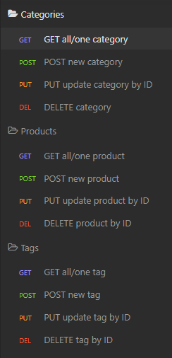
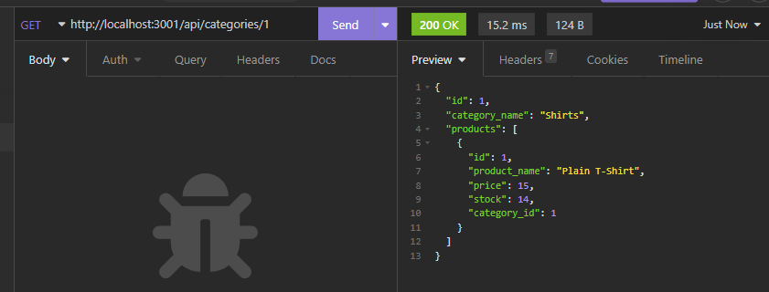
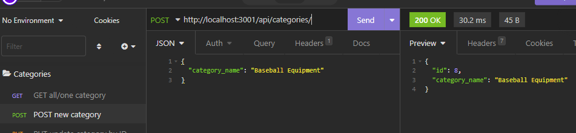
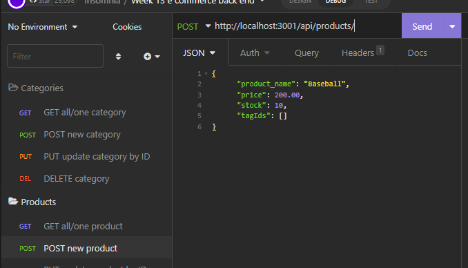
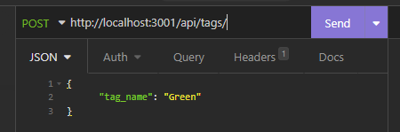
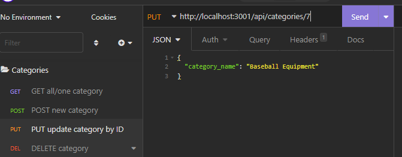

# Week 13: E-Commerce Back End

## Description

For our 13th week in our coding bootcamp, we were to build off of starter code using sequelize to create the back end for a demonstration e-commerce database. Our task was specifically to form the models and API routes for the applicaiton.

Having learned a lesson from our Week 11 assignment, I made sure to focus on just the files that needed to be added to. In this assignment our task is only relative to the models and routes folder. Too often with these starter code assignments it's easy to become overwhelmed at having a whole application presented to you. 

First order of business was to assemble the models that will be used to seed our database. Looking over the Sequelize docs and referencing classwork code, it wasn't long before all the models were properly made. After some testing and rooting out a typo that duplicated a particular column, the database was ready to be seeded.

Next were the routes. This turned out to be relatively simple once familiarized with the syntax. Compared to the previous assignment which used clunky mysql.createConnection syntax to make database calls, Sequelize definitely increases what can be done per line of code. It's similar to how we used basic Javascript to interact with the DOM for a few assignments so we could appreciate how much more efficient jQuery was.

## Installation

Once you have cloned the repo to your machine, run **npm i** to instal all the necessary dependencies.

Then to initialize the database, open **./db** in an integrated terminal and login to mysql using **mysql -u root -p** or an appropriate equivalent. Then **source schema.sql;** to create the ecommerce_db database. **Any preexisting database named ecommerce_db will be dropped.**

To seed the database, run **node seeds/index.js** in the root folder.

## Usage

- In order to utilize and test the various routes using Insomnia, it is advised you create a number of routes seen below.

- All routes will be found at **http<nolink>://localhost:3001/api/** 

- All GET requests will follow a similar structure and produce JSON objects appropriate to their route. Category requests will show the products in that category, product requests will show all tags associated with that product, and tag reuqests will show all associated products.

- Requests made at a URL with no params will return all objects in that route. For example, **./api/categories/** will return all categories.

- While **./api/categories/:id** will return just one category, and all products associated with it.

- To create a new category, product, or tag, submit a post requqest formatted like the examples below.

- New category:

- New product:

- New tag:

- To update a category, product, or tag: format the URL like a GET ONE request and format the request itself like a POST request.

## License

Standard MIT license, coursework.

Starter code provided by the UofM Full Stack Coding Bootcamp.

This project makes use of [mysql](https://www.mysql.com/) and [Sequelize](https://sequelize.org/)